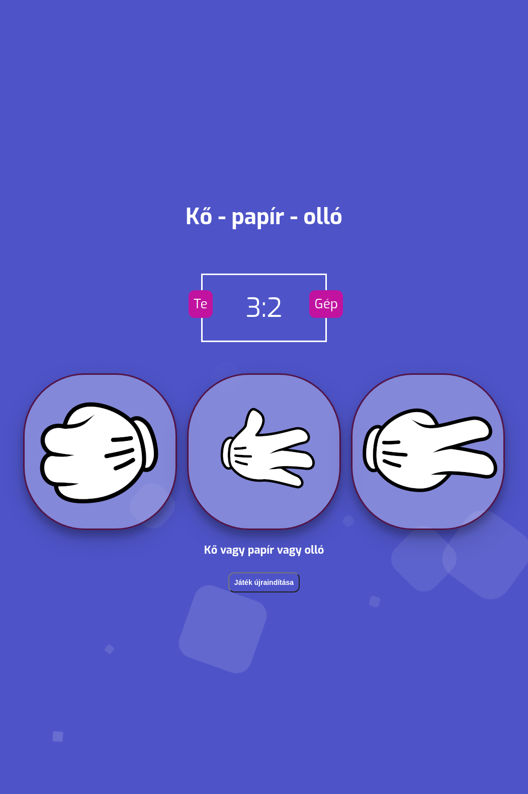

# ko_papir_ollo
> Kő papír olló projektmunka

## Table of contents
- [ko_papir_ollo](#ko_papir_ollo)
  - [Table of contents](#table-of-contents)
  - [General info](#general-info)
  - [Screenshots](#screenshots)
  - [Written in](#written-in)
  - [Webpage](#webpage)
  - [Status](#status)
  - [Contact](#contact)

## General info
Basic kő papír olló játék HTML, CSS, JS használatával.\
Gép ellen mérhetjuk fel tudásunkat (szerencsénket).

## Screenshots

## Written in
HTML\
CSS\
JavaScript

## Webpage
Ezen a [linken](https://victorbuscsei.ddns.net/ko_papir_ollo/) megtekinthető.

## Status
Project is : _in progress_

## Contact
Created by [@VictorBuscsei](https://github.com/VictorBuscsei)    Meh (view source by clicking "Raw")
<!-- Azok a cseszett div-ek megőritenek:D-->